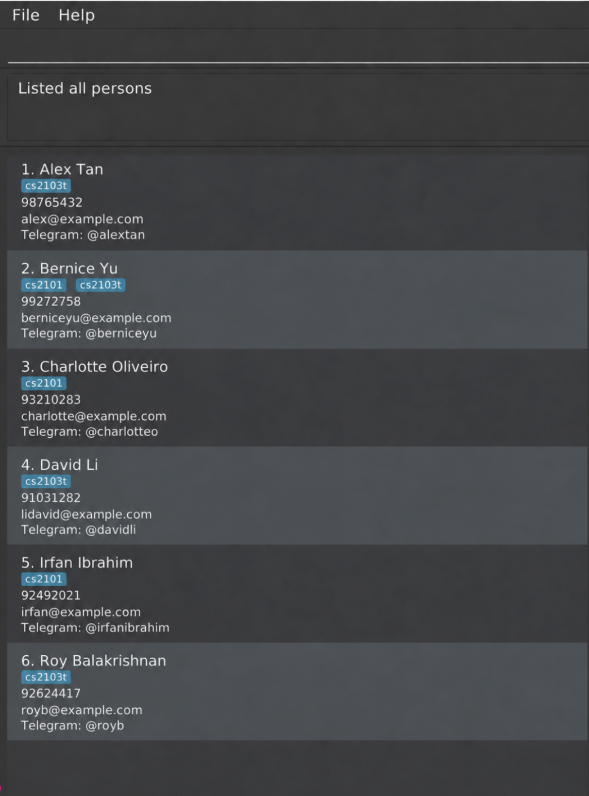

# LinkUp

**LinkUp is a desktop address book for students who manage contacts across multiple projects and teams.**

It helps students organise their project mates' contact details together with relevant project information. This makes it easier to retrieve the right contact quickly and distinguish between people with identical or similar names across different projects.

## UI mockup

The mockup below illustrates the planned LinkUp interface.

## Documentation

Visit the [LinkUp product website](https://ay2627s1-cs2103t-w14-2.github.io/tp/) for project documentation:

- [User Guide](https://ay2627s1-cs2103t-w14-2.github.io/tp/UserGuide.html)
- [Developer Guide](https://ay2627s1-cs2103t-w14-2.github.io/tp/DeveloperGuide.html)
- [About Us](https://ay2627s1-cs2103t-w14-2.github.io/tp/AboutUs.html)

## Acknowledgement
This project is based on the AddressBook-Level3 project created by the [SE-EDU initiative](https://se-education.org)
