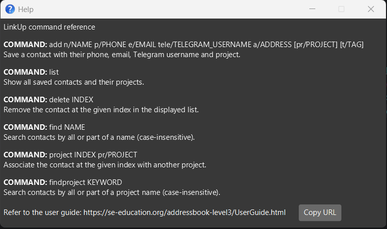

# AB-3 User Guide

AddressBook Level 3 (AB3) is a **desktop application for managing contacts, optimized for use through a Command Line Interface (CLI)** while retaining the benefits of a Graphical User Interface (GUI). If you type quickly, AB3 can help you manage contacts faster than traditional GUI applications.

<!-- * Table of Contents -->
<page-nav-print />

--------------------------------------------------------------------------------------------------------------------

## Quick start

1. Ensure that Java `25` or later is installed on your computer. 
   **Mac users:** Ensure you have the precise JDK version prescribed [here](https://se-education.org/guides/tutorials/javaInstallationMac.html).

1. Download the latest `.jar` file from [here](https://github.com/se-edu/addressbook-level3/releases).

1. Copy the file to the folder you want to use as the _home folder_ for your AddressBook.

1. Open a terminal, `cd` to the folder containing the JAR file, and run `java -jar addressbook.jar`. 
   A GUI similar to the one below should appear in a few seconds. Note how the app contains some sample data. 
   

1. Type a command in the command box and press Enter to execute it. For example, type **`help`** and press Enter to open the help window. 
   Some example commands you can try:

   * `list` : Lists all contacts.

   * `add n/John Doe p/98765432 e/johnd@example.com tele/@john_doe a/John street, block 123, #01-01 pr/CS2103T` : Adds a contact named `John Doe` to the Address Book.

   * `delete 3` : Deletes the 3rd contact shown in the current list.

   * `clear` : Deletes all contacts.

   * `exit` : Exits the app.

1. Refer to the [Features](#features) section below for details of each command.

--------------------------------------------------------------------------------------------------------------------

## Features

<box type="info" seamless>

**Notes about the command format:** 

* Words in `UPPER_CASE` are the parameters to be supplied by the user. 
  For example, in `add n/NAME`, replace `NAME` with a value such as `John Doe`.

* Items in square brackets are optional. 
  For example, `n/NAME [t/TAG]` can be used as `n/John Doe t/friend` or as `n/John Doe`.

* Items followed by `...` can appear zero or more times. 
  For example, `[t/TAG]... ` may be omitted, or written as `t/friend` or `t/friend t/family`.

* Parameters can be in any order. 
  For example, if the command specifies `n/NAME p/PHONE_NUMBER`, `p/PHONE_NUMBER n/NAME` is also acceptable.

* Extraneous parameters for commands that take no parameters, such as `help`, `list`, `exit`, and `clear`, are ignored. 
  For example, `help 123` is interpreted as `help`.

* If you are using a PDF version of this document, be careful when copying and pasting commands that span multiple lines as space characters surrounding line-breaks may be omitted when copied over to the application.
</box>

### Viewing help: `help`

Shows a message explaining how to access the help page.

Format: `help`

### Adding a person: `add`

Adds a person to the address book.

Format: `add n/NAME p/PHONE_NUMBER e/EMAIL tele/TELEGRAM_USERNAME a/ADDRESS [pr/PROJECT] [t/TAG]... `

<box type="tip" seamless>

**Tip:** A person can have one initial project or no project, and any number of tags, including zero.

The Telegram username is required. It must contain 5–32 Latin letters, digits, or underscores. A leading `@` is
optional, and uppercase letters are accepted. The username is stored in lowercase and displayed with a leading `@`.

The project is optional. A project name must contain 1–40 printable characters. Surrounding whitespace is removed,
repeated internal whitespace is collapsed, and project names are compared case-insensitively. Only one `pr/` prefix
is accepted by the `add` command. If `pr/` is provided, it must not be empty.
</box>

Examples:
* `add n/John Doe p/98765432 e/johnd@example.com tele/@john_doe a/John street, block 123, #01-01 pr/CS2103T`
* `add n/Betsy Crowe t/friend e/betsycrowe@example.com tele/betsy_crowe a/Newgate Prison p/1234567 t/criminal`

### Listing all persons: `list`

Shows a list of all persons in the address book.

Format: `list`

### Editing a person: `edit`

Edits an existing person in the address book.

Format: `edit INDEX [n/NAME] [p/PHONE] [e/EMAIL] [a/ADDRESS] [t/TAG]... `

* Edits the person at the specified `INDEX`. The index refers to the index number shown in the displayed person list. The index **must be a positive integer** 1, 2, 3, ...
* At least one of the optional fields must be provided.
* Existing values will be updated to the input values.
* When editing tags, all of the person's existing tags are removed; adding tags is not cumulative.
* To remove all of a person's tags, enter `t/` without a tag after it.

Examples:
*  `edit 1 p/91234567 e/johndoe@example.com` Edits the phone number and email address of the 1st person to be `91234567` and `johndoe@example.com` respectively.
*  `edit 2 n/Betsy Crower t/` Edits the name of the 2nd person to be `Betsy Crower` and clears all existing tags.

### Locating persons by name: `find`

Finds persons whose names contain any of the given keywords.

Format: `find KEYWORD [MORE_KEYWORDS]`

* The search is case-insensitive; for example, `hans` matches `Hans`.
* Keyword order does not matter; for example, `Hans Bo` matches `Bo Hans`.
* The search considers only names.
* Only full words match; for example, `Han` does not match `Hans`.
* Persons matching at least one keyword are returned (an `OR` search); for example, `Hans Bo` returns `Hans Gruber` and `Bo Yang`.

Examples:
* `find John` returns `john` and `John Doe`
* `find alex david` returns `Alex Yeoh`, `David Li` 
  

### Finding contacts by project: `findproject`

Finds contacts associated with projects whose names contain the given phrase.

Format: `findproject KEYWORD`

* Matching is case-insensitive and partial: `cs2103` matches `CS2103T`.
* The entire keyword is one phrase. `team alpha` matches `CS2103T Team Alpha`, but does not match
  `Team Beta`, `Alpha Team`, or separate projects named `Team` and `Alpha`.
* Surrounding whitespace is ignored and repeated internal whitespace is treated as a single space when matching.
* The keyword must contain 1–40 characters after trimming surrounding whitespace. Internal spaces count towards
  this limit before they are collapsed. Each Unicode code point counts as one character.
* Any associated project can match. Each contact appears once, with its contact details and projects, in the
  existing contact order. Contacts with no projects are excluded.
* Every search checks all saved contacts and replaces the previous search results. Use `list` to show all contacts again.
* Matching contacts are displayed with the message `Found N contact(s) matching the project keyword.`
  If nothing matches, the displayed list is empty and the message is `No contacts found for the project keyword.`
* Blank or excessively long keywords produce an error and leave the current results and saved contacts unchanged.

Examples:

* `findproject cs2103` finds contacts in projects such as `CS2103T` and `CS2103T Team Alpha`.
* `findproject team alpha` finds contacts whose project names contain the phrase `team alpha`, ignoring case.
* `findproject orbital` followed by `delete 1` deletes the first contact in those search results.

### Deleting a person: `delete`

Deletes the specified person from the address book.

Format: `delete INDEX`

* Deletes the person at the specified `INDEX`.
* The index refers to the index number shown in the displayed person list.
* The index **must be a positive integer** 1, 2, 3, ...

Examples:
* `list` followed by `delete 2` deletes the 2nd person in the address book.
* `find Betsy` followed by `delete 1` deletes the 1st person in the results of the `find` command.

### Clearing all entries: `clear`

Clears all entries from the address book.

Format: `clear`

### Exiting the program: `exit`

Exits the program.

Format: `exit`

### Saving the data

AddressBook automatically saves data after every command. You do not need to save manually.

### Editing the data file

AddressBook data is saved automatically as a JSON file `[JAR file location]/data/addressbook.json`. Advanced users are welcome to update data directly by editing that data file.

<box type="warning" seamless>

**Caution:**
If your changes make the data file invalid, AddressBook starts with an empty address book at the next run. The invalid file remains on disk until you run a command (AddressBook saves after every command). Still, we recommend backing up the file before editing it. 
Furthermore, certain edits can cause the AddressBook to behave in unexpected ways (e.g., if a value entered is outside of the acceptable range). Therefore, edit the data file only if you are confident that you can update it correctly.
</box>

### Archiving data files `[coming in v2.0]`

_Details coming soon ..._

--------------------------------------------------------------------------------------------------------------------

## FAQ

**Q**: How do I transfer my data to another computer? 
**A**: Install the app on the other computer and overwrite the data file it creates with the data file from your previous AddressBook home folder.

--------------------------------------------------------------------------------------------------------------------

## Known issues

1. **When using multiple screens**, if you move the application to a secondary screen, and later switch to using only the primary screen, the GUI will open off-screen. The remedy is to delete the `preferences.json` file created by the application before running the application again.
2. **If you minimize the Help Window** and then run the `help` command (or use the `Help` menu, or the keyboard shortcut `F1`) again, the original Help Window will remain minimized, and no new Help Window will appear. The remedy is to manually restore the minimized Help Window.

--------------------------------------------------------------------------------------------------------------------

## Command summary

Action     | Format, Examples
-----------|----------------------------------------------------------------------------------------------------------------------------------------------------------------------
**Add**    | `add n/NAME p/PHONE_NUMBER e/EMAIL tele/TELEGRAM_USERNAME a/ADDRESS [pr/PROJECT] [t/TAG]... `   e.g., `add n/James Ho p/22224444 e/jamesho@example.com tele/james_ho a/123, Clementi Rd, 1234665 pr/CS2103T t/friend t/colleague`
**Clear**  | `clear`
**Delete** | `delete INDEX`  e.g., `delete 3`
**Edit**   | `edit INDEX [n/NAME] [p/PHONE_NUMBER] [e/EMAIL] [a/ADDRESS] [t/TAG]... `  e.g.,`edit 2 n/James Lee e/jameslee@example.com`
**Find**   | `find KEYWORD [MORE_KEYWORDS]`  e.g., `find James Jake`
**Find by project** | `findproject KEYWORD`  e.g., `findproject team alpha`
**List**   | `list`
**Help**   | `help`
